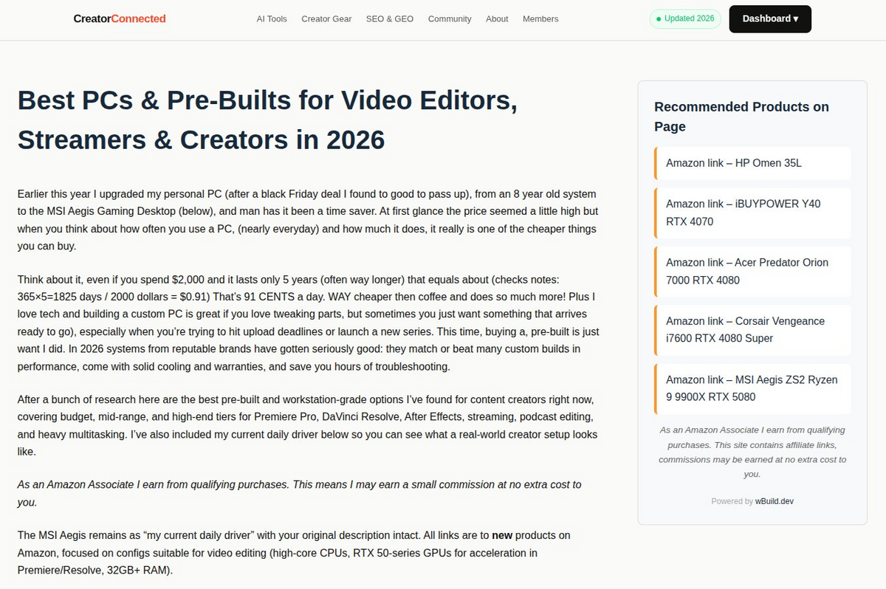
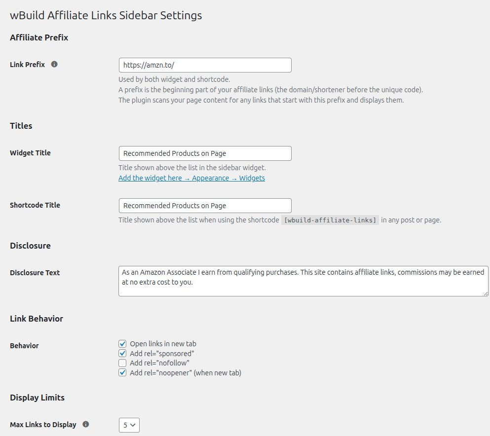
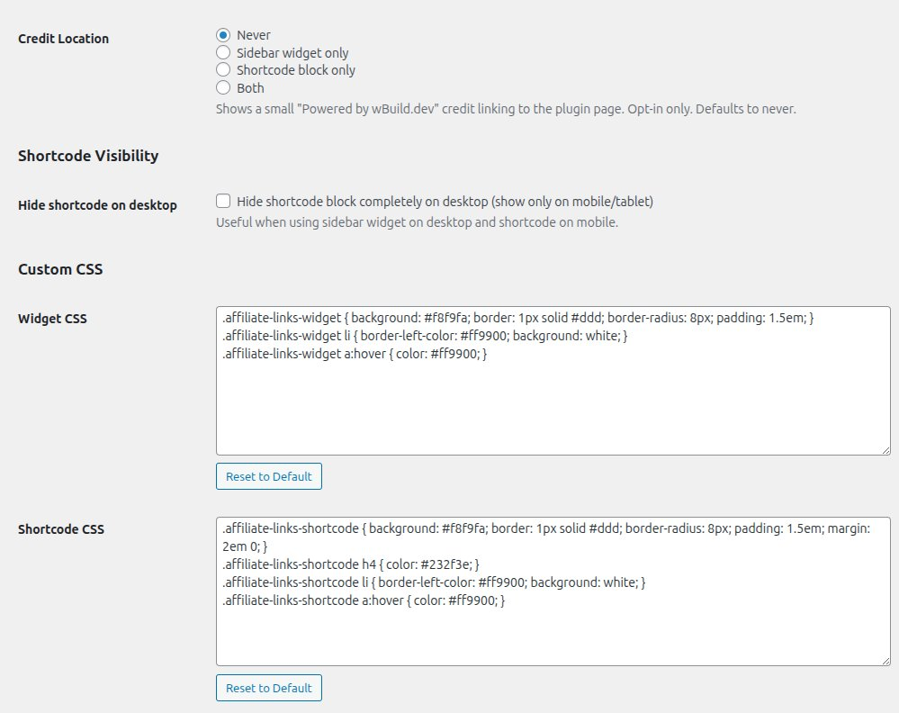
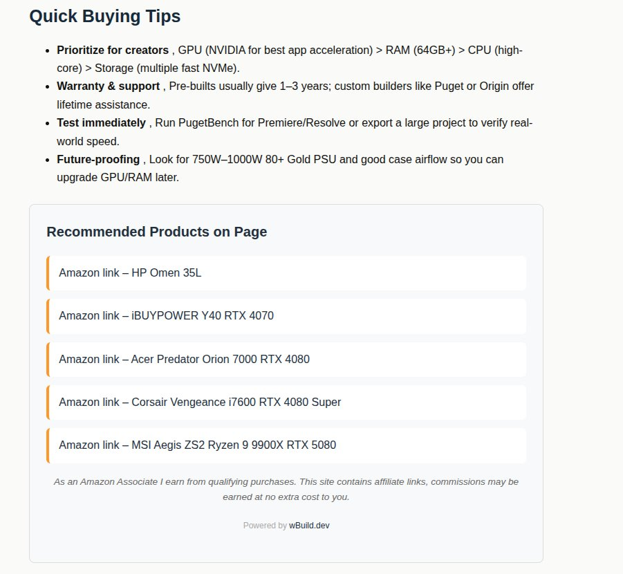
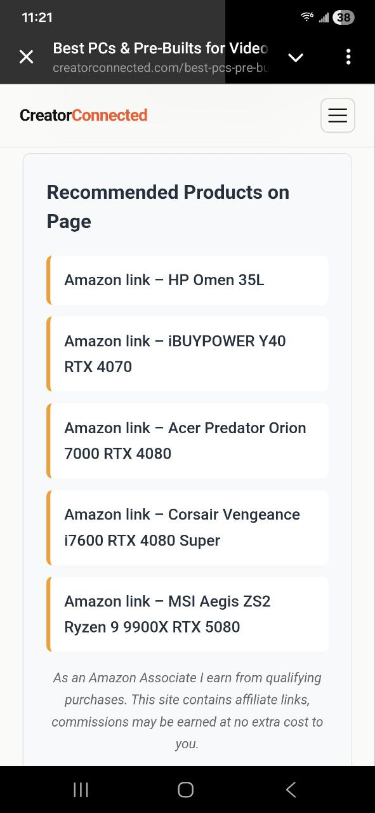
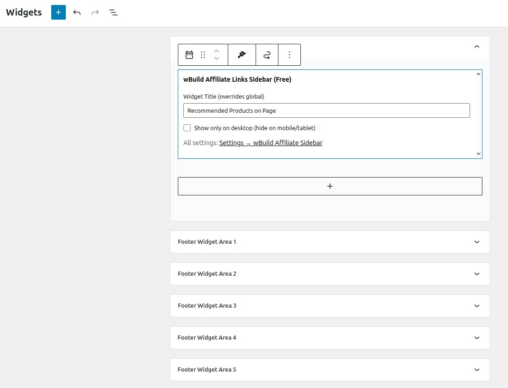

# wBuild Affiliate Links Sidebar v1.7.1

Auto-detects affiliate links in your content and displays them in a sidebar widget or shortcode.

## How It Works

The plugin scans your post/page content for affiliate links matching a prefix you set (e.g. `https://amzn.to/`) and displays them automatically in:

- A sidebar widget (Appearance → Widgets)
- An inline shortcode `[wbuild-affiliate-links]`

No manual imports, no API keys - just write your content with affiliate links and the plugin does the rest.

## Features

- Single affiliate prefix (e.g. Amazon amzn.to)
- 1-5 links displayed per page (configurable)
- Customizable titles, disclosure text, and link behavior
- Mobile/desktop visibility controls
- Custom CSS for widget and shortcode
- Clean, modern design with hover effects

## Screenshots

## Installation

1. Upload the `wbuild-affiliate-links-sidebar` folder to `/wp-content/plugins/`
2. Activate via Plugins screen
3. Configure at **Settings → wBuild Affiliate Sidebar**

## Requirements

- WordPress 6.0+
- PHP 7.4+

## Changelog

### 1.7.1
- Security: CSS fields sanitized with wp_strip_all_tags() on save
- Security: Individual $_POST keys accessed directly instead of processing entire array
- Security: credit_location validated against allowed values
- Prefixed shortcode name to `[wbuild-affiliate-links]` for uniqueness
- Used absint() for max_links_display input

### 1.7.0
- Rebranded to wBuild Affiliate Links Sidebar under wBuild.dev
- All CSS properly enqueued via wp_register_style and wp_add_inline_style
- Admin CSS loaded via admin_enqueue_scripts hook
- Credit link opt-in only, defaults to never
- Updated text domain and function prefixes

## License

GPL-2.0 - see [LICENSE](LICENSE) for details.

## Links

- [WordPress.org](https://wordpress.org/plugins/wbuild-affiliate-links-sidebar/)
- [Plugin Page](https://wbuild.dev/affiliate-links-sidebar/)
- [Pro Version](https://wbuild.dev/affiliate-links-sidebar/)
- [wBuild.dev](https://wbuild.dev)

## Support wBuild

wBuild is independently developed with no VC funding, no ads, and no data collection. If this plugin saves you time or helps you earn, consider supporting future development:

[PayPal](https://paypal.me/wbuild) · [Cash App](https://cash.app/$wbuild) · BTC: `16cj4pbkWrTmoaUUkM1XWkxGTsvnywwS8C`

Every contribution helps keep wBuild tools updated and independent.
